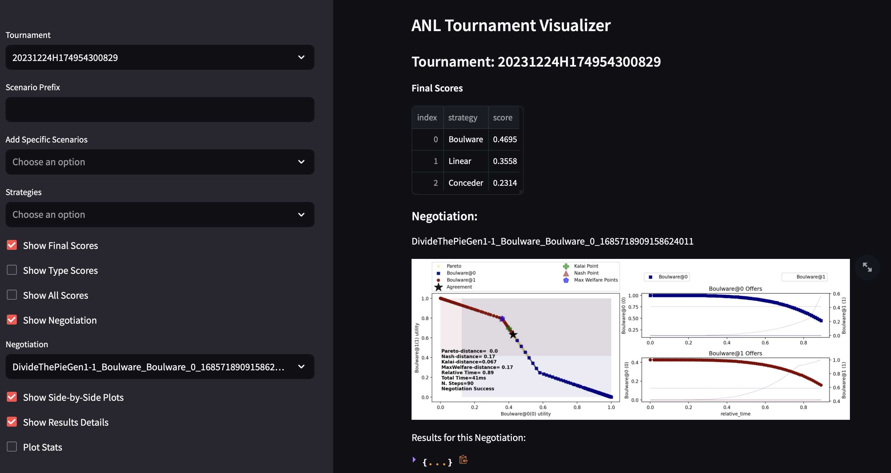

# ANL Documentation

This repository is the official platform for running ANAC Automated Negotiation Leagues (starting 2024). It will contain a package
called `anlXXXX` for the competition run in year XXXX. For example anl2024 will contain all files related to the
2024's version of the competition.

This package is a thin-wrapper around the [NegMAS](https://negmas.readthedocs.io) library for automated negotiation. Its main goal is to provide the following functionalities:

1. A set of utility functions to run tournaments in the same settings as in the ANL competition. These functions are always called `anl20XX_tournament` for year `20XX`.
1. A CLI for running tournaments called `anl`.
1. A place to hold the official implementation of every strategy submitted to the ANL competition after each year. These can be found in the module `anl.anl20XX.negotiators` for year `20XX`.

The official website for the ANL competition is:
[https://scml.cs.brown.edu/anl](https://scml.cs.brown.edu/anl)


## Installation

    pip install anl

You can also install the in-development version with::

    pip install https://github.com/autoneg/anl/archive/master.zip


## Documentation

* Documentation for the ANL package: [https://yasserfarouk.github.io/anl/](https://yasserfarouk.github.io/anl/)
* Documentation for the NegMAS library: [https://negmas.readthedocs.io](https://negmas.readthedocs.io)


## CLI

After installation, you can try running a tournament using the CLI:

```bash
anl tournament2024
```

To find all the parameters you can customize for running tournaments run:

```bash
anl tournament2024 --help
```

You can run the following command to check the versions of ANL and NegMAS on your machine:

```bash
anl version
```

You should get at least these versions:

```bash
anl: 0.1.5 (NegMAS: 0.10.9)
```

Other than the two commands mentioned above (tournament2024, version), you can use the CLI to generate and save scenarios which you can later reuse with the tournament2024 command using --scenarios-path.
As an example:

```bash
anl make-scenarios myscenarios --scenarios=5
anl tournament2024 --scenarios-path=myscenarios --scenarios=0
```
The first command will create 5 scenarios and save them under `myscenarios`. The second command will use these scenarios without generating any new scenarios to run a tournament.


## Visualizer


ANL comes with a simple visualizer that can be used to visualize logs from tournaments after the fact.

To start the visualizer type:

```bash
anlv show
```
This will allow you to select any tournament that is stored in the default location (~/negmas/anl2024/tournaments).
You can also show the tournament stored in a specific location '_path' using:

```bash
anlv show _path
```
